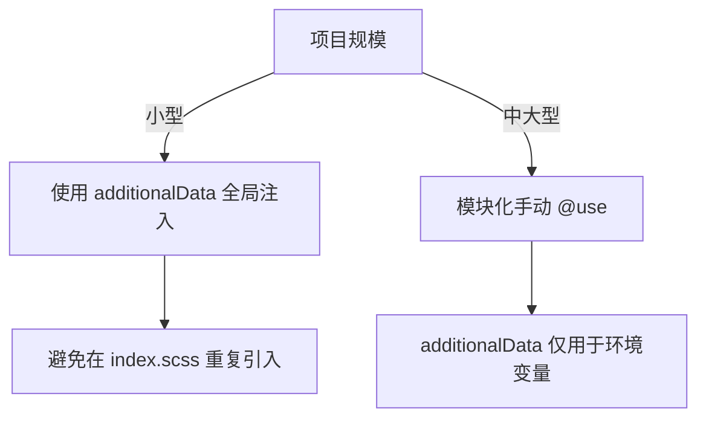

# 怎么在 index.scss 中合理组织全局样式文件

在项目中同时使用 **`index.scss` 的 `@use`** 和 **Vite 配置的 `additionalData`** 时，需要根据场景合理选择，避免重复或冲突。以下是详细分析和建议：

---

### **1. 两种配置的作用**
#### **(1) `index.scss` 中的 `@use`**
- **作用**：显式声明当前文件对 `variables.scss` 和 `mixins.scss` 的依赖。
- **特点**：
    - 模块化作用域，需手动在每个 SCSS 文件中按需引入。
    - 适合组件级样式文件（如 `component.module.scss`），避免全局污染。

#### **(2) Vite 的 `additionalData`**
- **作用**：全局注入 SCSS 代码到**所有样式文件**的头部（相当于自动在每个文件开头添加代码）。
- **特点**：
    - 避免在每个文件手动写 `@use`。
    - 适合全局共享的变量、Mixin（如主题色、工具函数）。

---

### **2. 是否需要同时配置？**
#### **✅ 推荐方案：二选一**
| 场景                     | 配置方式                     | 优点                          | 缺点                          |
|--------------------------|-----------------------------|-------------------------------|-------------------------------|
| **全局样式共享**         | 仅用 `additionalData`       | 减少重复代码，全项目自动生效  | 可能造成不必要的样式注入      |
| **模块化/组件化开发**    | 仅用 `index.scss` 的 `@use` | 作用域清晰，按需加载          | 每个文件需手动引入            |
| **混合使用（谨慎）**     | 两者同时配置                | 灵活性强                      | 需避免变量重复定义或冲突      |

#### **❌ 避免的问题**
- **重复引入**：  
  若同时在 `additionalData` 和 `index.scss` 中引入 `variables.scss`，会导致：
    - 变量/Mixin 被多次加载（可能引发 Sass 警告）。
    - 增加构建体积（虽然 Sass 会去重，但仍有开销）。

- **变量覆盖风险**：  
  `additionalData` 中的 `$injected-color` 可能被后续文件意外覆盖。

---

### **3. 具体实践建议**
#### **(1) 纯全局模式（推荐简单项目）**
**配置方式**：
- **仅使用 `additionalData`**，不在 `index.scss` 中写 `@use`。
- 适用于所有样式共享同一套变量/Mixin 的小型项目。

```javascript
// vite.config.ts
additionalData: `
  @use "@/styles/variables.scss" as *;
  @use "@/styles/mixins.scss" as *;
  $injected-color: ${process.env.NODE_ENV === 'production' ? 'green' : 'red'};
`,
```

#### **(2) 模块化模式（推荐大型项目）**
**配置方式**：
- **禁用 `additionalData` 中的 `@use`**，仅在 `index.scss` 或组件文件中手动引入。
- 适合需要明确作用域的中大型项目。

```javascript
// vite.config.ts
additionalData: `$injected-color: ${process.env.NODE_ENV === 'production' ? 'green' : 'red'};`, // 只注入必要的全局变量
```

```scss
// styles/index.scss
@use 'variables' as *;
@use 'mixins' as *;
```

#### **(3) 混合模式（需谨慎）**
**配置方式**：
- `additionalData` 仅注入**极少全局变量**（如环境变量）。
- `index.scss` 管理样式工具和布局。

```javascript
// vite.config.ts
additionalData: `$env-mode: ${process.env.NODE_ENV};`, // 仅注入环境相关变量
```

```scss
// styles/index.scss
@use 'variables' as *;
@use 'mixins' as *;

body {
  background-color: if($env-mode == 'production', $color-green, $color-red);
}
```

---

### **4. 决策流程图**


---

### **总结**
- **不要重复配置**：`variables/mixins` 的引入应在 `additionalData` 或 `index.scss` 中二选一。
- **推荐选择**：
    - 全剧变量：`additionalData`（简单项目）。
    - 模块化：手动 `@use`（大型项目）。
- **混合使用**：仅在需要动态注入环境变量时，且确保变量命名不冲突。


# index.scss 的 @use 'variables' as * 和 Vite 配置的 additionalData 的关系

在项目中同时使用 **`index.scss` 的 `@use`** 和 **Vite 配置的 `additionalData`** 时，需要根据场景合理选择，避免重复或冲突。以下是详细分析和建议：

---

### **1. 两种配置的作用**
#### **(1) `index.scss` 中的 `@use`**
- **作用**：显式声明当前文件对 `variables.scss` 和 `mixins.scss` 的依赖。
- **特点**：
    - 模块化作用域，需手动在每个 SCSS 文件中按需引入。
    - 适合组件级样式文件（如 `component.module.scss`），避免全局污染。

#### **(2) Vite 的 `additionalData`**
- **作用**：全局注入 SCSS 代码到**所有样式文件**的头部（相当于自动在每个文件开头添加代码）。
- **特点**：
    - 避免在每个文件手动写 `@use`。
    - 适合全局共享的变量、Mixin（如主题色、工具函数）。

---

### **2. 是否需要同时配置？**
#### **✅ 推荐方案：二选一**
| 场景                     | 配置方式                     | 优点                          | 缺点                          |
|--------------------------|-----------------------------|-------------------------------|-------------------------------|
| **全局样式共享**         | 仅用 `additionalData`       | 减少重复代码，全项目自动生效  | 可能造成不必要的样式注入      |
| **模块化/组件化开发**    | 仅用 `index.scss` 的 `@use` | 作用域清晰，按需加载          | 每个文件需手动引入            |
| **混合使用（谨慎）**     | 两者同时配置                | 灵活性强                      | 需避免变量重复定义或冲突      |

#### **❌ 避免的问题**
- **重复引入**：  
  若同时在 `additionalData` 和 `index.scss` 中引入 `variables.scss`，会导致：
    - 变量/Mixin 被多次加载（可能引发 Sass 警告）。
    - 增加构建体积（虽然 Sass 会去重，但仍有开销）。

- **变量覆盖风险**：  
  `additionalData` 中的 `$injected-color` 可能被后续文件意外覆盖。

---

### **3. 具体实践建议**
#### **(1) 纯全局模式（推荐简单项目）**
**配置方式**：
- **仅使用 `additionalData`**，不在 `index.scss` 中写 `@use`。
- 适用于所有样式共享同一套变量/Mixin 的小型项目。

```javascript
// vite.config.ts
additionalData: `
  @use "@/styles/variables.scss" as *;
  @use "@/styles/mixins.scss" as *;
  $injected-color: ${process.env.NODE_ENV === 'production' ? 'green' : 'red'};
`,
```

#### **(2) 模块化模式（推荐大型项目）**
**配置方式**：
- **禁用 `additionalData` 中的 `@use`**，仅在 `index.scss` 或组件文件中手动引入。
- 适合需要明确作用域的中大型项目。

```javascript
// vite.config.ts
additionalData: `$injected-color: ${process.env.NODE_ENV === 'production' ? 'green' : 'red'};`, // 只注入必要的全局变量
```

```scss
// styles/index.scss
@use 'variables' as *;
@use 'mixins' as *;
```

#### **(3) 混合模式（需谨慎）**
**配置方式**：
- `additionalData` 仅注入**极少全局变量**（如环境变量）。
- `index.scss` 管理样式工具和布局。

```javascript
// vite.config.ts
additionalData: `$env-mode: ${process.env.NODE_ENV};`, // 仅注入环境相关变量
```

```scss
// styles/index.scss
@use 'variables' as *;
@use 'mixins' as *;

body {
  background-color: if($env-mode == 'production', $color-green, $color-red);
}
```

---

### **4. 决策流程图**


---

### **总结**
- **不要重复配置**：`variables/mixins` 的引入应在 `additionalData` 或 `index.scss` 中二选一。
- **推荐选择**：
    - 全剧变量：`additionalData`（简单项目）。
    - 模块化：手动 `@use`（大型项目）。
- **混合使用**：仅在需要动态注入环境变量时，且确保变量命名不冲突。