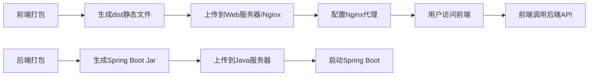

对于前后端分离的项目（Vue3 + TS + Vite 前端 + Spring Boot 后端），部署的核心是将前端静态资源与后端服务独立部署，并通过 API 通信。以下是详细步骤：

---

### **一、部署流程图**


---

### **二、具体部署步骤**

#### **1. 前端部署（Vue3 + Vite）**
**步骤 1.1：本地打包前端**
```bash
# 进入前端项目目录
cd frontend-project

# 安装依赖（如果未安装）
npm install

# 打包生产环境代码（生成dist目录）
npm run build
```
- 生成的静态文件位于 `dist` 目录（包含 `index.html`、JS、CSS 等）。

**步骤 1.2：上传前端文件到服务器**
- 通过 `scp`/`rsync`/FTP 将 `dist` 目录上传到服务器（例如 Nginx 的默认静态资源目录）：
  ```bash
  scp -r dist/ user@your-server:/var/www/html/frontend
  ```

**步骤 1.3：配置 Nginx**
- 编辑 Nginx 配置（如 `/etc/nginx/conf.d/your-site.conf`）：
  ```nginx
  server {
    listen 80;
    server_name your-domain.com;  # 替换为域名或IP

    # 前端静态资源
    root /var/www/html/frontend;
    index index.html;

    # 处理前端路由（Vue SPA 需配置）
    location / {
      try_files $uri $uri/ /index.html;
    }

    # 反向代理后端API
    location /api {
      proxy_pass http://localhost:8080;  # 转发到Spring Boot
      proxy_set_header Host $host;
      proxy_set_header X-Real-IP $remote_addr;
    }
  }
  ```
- 重启 Nginx：
  ```bash
  sudo nginx -t   # 测试配置
  sudo systemctl restart nginx
  ```

---

#### **2. 后端部署（Spring Boot）**
**步骤 2.1：本地打包 Spring Boot**
```bash
# 进入后端项目目录
cd backend-project

# Maven 打包（生成可执行Jar）
mvn clean package -DskipTests
```
- 生成的 Jar 文件位于 `target/your-application.jar`。

**步骤 2.2：上传 Jar 文件到服务器**
```bash
scp target/your-application.jar user@your-server:/home/backend
```

**步骤 2.3：服务器环境准备**
- 确保服务器已安装：
    - **JDK 17+**（Spring Boot 3.x 要求）：
      ```bash
      sudo apt install openjdk-17-jdk
      ```
    - （可选）数据库（如 MySQL/PostgreSQL）。

**步骤 2.4：启动 Spring Boot**
- 使用 `nohup` 或系统服务（如 `systemd`）运行：
  ```bash
  # 简单启动（后台运行）
  nohup java -jar /home/backend/your-application.jar --spring.profiles.active=prod > /var/log/backend.log 2>&1 &

  # 或用systemd（推荐）
  sudo vim /etc/systemd/system/backend.service
  ```
  **systemd 配置示例**：
  ```ini
  [Unit]
  Description=Spring Boot Backend
  After=syslog.target

  [Service]
  User=your-user
  ExecStart=/usr/bin/java -jar /home/backend/your-application.jar --spring.profiles.active=prod
  Restart=always

  [Install]
  WantedBy=multi-user.target
  ```
- 启动服务：
  ```bash
  sudo systemctl daemon-reload
  sudo systemctl start backend
  sudo systemctl enable backend  # 开机自启
  ```

---

### **三、关键配置注意事项**
1. **前端 API 基地址**
    - 在 Vue 项目中，确保 API 请求指向后端地址（通过环境变量或配置文件）：
      ```env
      # .env.production
      VITE_API_BASE_URL=/api  # 通过Nginx代理
      # 或直接写后端地址（不推荐）
      VITE_API_BASE_URL=http://your-api-domain.com:8080
      ```

2. **跨域问题**
    - 如果前端直接调用后端（不经过Nginx代理），需在 Spring Boot 中配置 CORS：
      ```java
      @Configuration
      public class CorsConfig implements WebMvcConfigurer {
          @Override
          public void addCorsMappings(CorsRegistry registry) {
              registry.addMapping("/**")
                      .allowedOrigins("https://your-frontend-domain.com")
                      .allowedMethods("*");
          }
      }
      ```

3. **HTTPS 配置（可选）**
    - 使用 Let's Encrypt 为 Nginx 配置 SSL：
      ```bash
      sudo apt install certbot python3-certbot-nginx
      sudo certbot --nginx -d your-domain.com
      ```

4. **静态资源缓存**
    - 在 Nginx 中为静态文件设置缓存策略：
      ```nginx
      location /assets {
        expires 1y;
        add_header Cache-Control "public";
      }
      ```

---

### **四、验证部署**
1. **前端访问**
    - 打开浏览器访问 `http://your-domain.com`，确认页面加载正常。
2. **API 调用**
    - 检查前端是否成功调用后端 API（如 `/api/users`）。
3. **日志排查**
    - 后端日志：
      ```bash
      journalctl -u backend -f  # 查看Spring Boot日志
      ```
    - Nginx 日志：
      ```bash
      tail -f /var/log/nginx/error.log
      ```

---

### **五、扩展优化**
- **CDN 加速**：将前端静态资源上传到 CDN（如 AWS S3 + CloudFront）。
- **负载均衡**：后端多实例部署 + Nginx 负载均衡。
- **CI/CD**：通过 GitHub Actions/Jenkins 自动化构建和部署。

---

### **总结**
1. 前端打包 → Nginx 托管静态文件 + 反向代理后端 API。
2. 后端打包 → 通过 Java 运行 Jar，确保与前端 API 连通。
3. 通过 Nginx 统一入口，实现前后端分离部署。