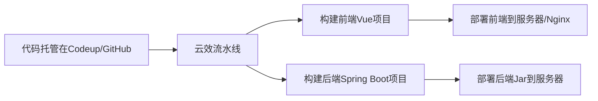

# 前后端项目实现自动化部署解决方案

要实现前后端分离项目（Vue3 + Spring Boot）的 **一键自动化部署**，可以通过 **CI/CD 工具**（如 GitHub Actions、Jenkins）或 **容器化技术**（Docker + Docker Compose）来简化流程。以下是几种高效方案：

---

### **方案 1：使用 GitHub Actions 全自动化部署**
**适用场景**：代码托管在 GitHub，希望提交代码后自动构建并部署到服务器。  
**优势**：完全自动化，无需手动操作，适合个人或小团队项目。

#### **步骤 1：配置 GitHub Actions 工作流**
1. 在项目根目录创建 `.github/workflows/deploy.yml` 文件：
```yaml
name: Deploy Fullstack App

on:
  push:
    branches: [ "main" ]  # 监听main分支的推送

jobs:
  deploy:
    runs-on: ubuntu-latest
    steps:
      # 1. 检出代码
      - uses: actions/checkout@v4

      # 2. 部署前端
      - name: Build and Deploy Frontend
        run: |
          cd frontend
          npm install
          npm run build
          scp -r dist/ user@your-server:/var/www/html/frontend
        env:
          SSH_PRIVATE_KEY: ${{ secrets.SSH_PRIVATE_KEY }}  # 提前配置SSH密钥

      # 3. 部署后端
      - name: Build and Deploy Backend
        run: |
          cd backend
          mvn clean package -DskipTests
          scp target/your-application.jar user@your-server:/home/backend
          ssh user@your-server "systemctl restart backend"
```

#### **步骤 2：配置服务器免密登录**
1. 在 GitHub 仓库的 `Settings > Secrets` 中添加：
    - `SSH_PRIVATE_KEY`：服务器的 SSH 私钥。
    - `SERVER_IP`：服务器 IP 地址。

#### **效果**：
- 每次推送代码到 `main` 分支后，GitHub Actions 会自动完成：
    1. 前端打包并上传到服务器。
    2. 后端打包并重启 Spring Boot 服务。

---

### **方案 2：使用 Docker + Docker Compose 一键部署**
**适用场景**：希望本地和服务器环境一致，快速启动整个系统。  
**优势**：隔离环境，避免依赖冲突，适合复杂项目。

#### **步骤 1：编写 Dockerfile 和 Compose 文件**
1. **前端 Dockerfile**（`frontend/Dockerfile`）：
```dockerfile
FROM node:18 as builder
WORKDIR /app
COPY package*.json ./
RUN npm install
COPY . .
RUN npm run build

FROM nginx:alpine
COPY --from=builder /app/dist /usr/share/nginx/html
COPY nginx.conf /etc/nginx/conf.d/default.conf
```

2. **后端 Dockerfile**（`backend/Dockerfile`）：
```dockerfile
FROM openjdk:17
WORKDIR /app
COPY target/your-application.jar app.jar
ENTRYPOINT ["java", "-jar", "app.jar"]
```

3. **docker-compose.yml**（项目根目录）：
```yaml
version: '3'
services:
  frontend:
    build: ./frontend
    ports:
      - "80:80"
    depends_on:
      - backend

  backend:
    build: ./backend
    ports:
      - "8080:8080"
    environment:
      - SPRING_PROFILES_ACTIVE=prod
```

#### **步骤 2：一键启动**
```bash
# 本地构建并启动（测试用）
docker-compose up --build

# 服务器上部署（需提前安装Docker和Compose）
scp -r ./frontend ./backend docker-compose.yml user@your-server:/opt/app
ssh user@your-server "cd /opt/app && docker-compose up -d --build"
```

#### **效果**：
- 前端运行在 Nginx 容器（端口 80）。
- 后端运行在 Java 容器（端口 8080）。
- 通过 `docker-compose` 一键管理。

---

### **方案 3：使用 Jenkins 自动化流水线**
**适用场景**：企业级部署，需要更复杂的流程控制（如测试、审批）。  
**优势**：灵活性强，支持多阶段部署。

#### **步骤 1：Jenkins 配置**
1. 安装 Jenkins 并配置 Git、Maven、Node.js 环境。
2. 创建流水线任务，使用 `Jenkinsfile`：
```groovy
pipeline {
  agent any
  stages {
    stage('Build Frontend') {
      steps {
        dir('frontend') {
          sh 'npm install'
          sh 'npm run build'
        }
      }
    }
    stage('Build Backend') {
      steps {
        dir('backend') {
          sh 'mvn clean package -DskipTests'
        }
      }
    }
    stage('Deploy') {
      steps {
        sh 'scp -r frontend/dist user@your-server:/var/www/html/frontend'
        sh 'scp backend/target/your-application.jar user@your-server:/home/backend'
        sh 'ssh user@your-server "systemctl restart backend"'
      }
    }
  }
}
```

#### **效果**：
- 点击 Jenkins 构建按钮后，自动完成全流程部署。

---

### **方案对比**
| 方案                | 适用场景                  | 优点                          | 缺点                  |
|---------------------|--------------------------|-------------------------------|-----------------------|
| **GitHub Actions**  | 个人/开源项目            | 无需额外服务器，配置简单      | 依赖 GitHub           |
| **Docker Compose**  | 需要环境隔离             | 一键启动，环境一致            | 需学习 Docker         |
| **Jenkins**         | 企业级复杂流程           | 高度可定制，支持多阶段        | 需维护 Jenkins 服务器 |

---

### **终极懒人方案：现成工具**
1. **Vercel/Netlify（前端） + Railway（后端）**
    - 前端部署到 Vercel，后端部署到 Railway，两者均支持 GitHub 集成。
2. **CapRover**  
   自托管 PaaS 平台，支持 Docker 应用一键部署。

---

### **总结**
- **最快上手**：GitHub Actions（免费+自动化）。
- **最稳定**：Docker Compose（环境隔离+可移植）。
- **最专业**：Jenkins（适合团队协作）。

选择适合你团队的技术栈和运维能力的方案即可！


# 使用阿里云效运维平台实现项目自动化

完全可以使用 **阿里云效（DevOps）** 替代 Jenkins 实现前后端项目的自动化部署。云效提供了完整的 CI/CD 流水线功能，支持代码构建、测试、部署到服务器或 Kubernetes，且与阿里云生态深度集成。以下是具体实现步骤：

---

### **一、云效部署前后端分离项目的流程**


---

### **二、具体操作步骤**

#### **1. 准备工作**
- **代码仓库**：将前端（Vue3+Vite）和后端（Spring Boot）代码放入同一个仓库（推荐分目录存放，如 `frontend/` 和 `backend/`），或分开为两个仓库。
- **服务器权限**：确保云效有权限通过 **SSH** 访问你的服务器（需提前配置部署密钥）。
- **阿里云效账号**：开通 [阿里云效](https://devops.aliyun.com/)。

#### **2. 配置云效流水线**
**步骤 2.1：创建流水线**
1. 进入云效控制台，选择 **「流水线」** > **「新建流水线」**。
2. 选择代码源（如 Codeup、GitHub、GitLab）。

**步骤 2.2：配置构建阶段**
- **前端构建任务**：
    1. 添加一个 **「构建」** 阶段，命名为 `Build Frontend`。
    2. 选择 **Node.js** 环境，配置构建命令：
       ```bash
       cd frontend
       npm install
       npm run build
       ```
    3. 添加 **「归档产物」** 步骤，将 `frontend/dist` 目录保存为构建产物（后续部署使用）。

- **后端构建任务**：
    1. 添加另一个 **「构建」** 阶段，命名为 `Build Backend`。
    2. 选择 **Java** 环境，配置构建命令：
       ```bash
       cd backend
       mvn clean package -DskipTests
       ```
    3. 添加 **「归档产物」** 步骤，将 `backend/target/your-application.jar` 保存为产物。

**步骤 2.3：配置部署阶段**
- **前端部署到服务器**：
    1. 添加 **「主机部署」** 阶段，选择 **「上传部署包到主机」**。
    2. 选择前端构建阶段的产物（`dist` 目录）。
    3. 填写服务器 SSH 连接信息（IP、端口、密钥）。
    4. 配置目标路径（如 `/var/www/html/frontend`）。
    5. （可选）添加部署后命令（如重启 Nginx）：
       ```bash
       sudo systemctl restart nginx
       ```

- **后端部署到服务器**：
    1. 添加另一个 **「主机部署」** 阶段，选择后端构建的 Jar 包。
    2. 配置目标路径（如 `/home/backend`）。
    3. 添加部署后命令（启动 Spring Boot）：
       ```bash
       # 停止旧进程并启动新进程
       kill -9 $(lsof -t -i:8080) || true
       nohup java -jar /home/backend/your-application.jar --spring.profiles.active=prod > /var/log/backend.log 2>&1 &
       ```

#### **3. 触发规则配置**
- 设置流水线触发条件（如代码推送到 `main` 分支时自动运行）。
- 支持手动触发或定时触发。

---

### **三、关键配置注意事项**
1. **环境变量管理**
    - 在云效的 **「变量与参数」** 中配置敏感信息（如数据库密码、API 密钥），避免硬编码。
    - 前端可以通过 `.env` 文件注入变量（如 `VITE_API_BASE_URL=/api`）。

2. **Nginx 反向代理**  
   确保服务器上的 Nginx 已配置前端静态文件和后端 API 代理（同手动部署配置）：
   ```nginx
   server {
     listen 80;
     server_name your-domain.com;
     root /var/www/html/frontend;
     index index.html;

     location / {
       try_files $uri $uri/ /index.html;
     }

     location /api {
       proxy_pass http://localhost:8080;
     }
   }
   ```

3. **部署密钥配置**
    - 在云效的 **「证书与密钥」** 中上传服务器的 SSH 私钥。
    - 在流水线部署阶段选择该密钥。

4. **构建缓存优化**
    - 在构建阶段启用缓存（如 `node_modules` 和 `maven` 依赖），加速后续构建：
      ```yaml
      # 前端构建示例
      cache:
        path:
          - frontend/node_modules
      ```

---

### **四、扩展功能（可选）**
1. **自动化测试**
    - 在流水线中添加测试阶段（如前端 `npm run test` 或后端 `mvn test`）。

2. **多环境部署**
    - 通过云效的 **「环境管理」** 区分开发、测试、生产环境，动态切换配置。

3. **Kubernetes 部署**
    - 如果后端部署到阿里云 ACK（Kubernetes），可使用云效的 **「Kubernetes 部署」** 模板。

4. **通知与监控**
    - 配置企业微信、钉钉通知，或集成阿里云 SLS 日志服务。

---

### **五、与 Jenkins 的对比**
| **功能**         | **云效**                              | **Jenkins**                     |
|------------------|---------------------------------------|---------------------------------|
| **易用性**       | 图形化配置，开箱即用                  | 需手动安装插件和编写脚本        |
| **集成能力**     | 深度集成阿里云（ECS、ACK、OSS 等）    | 依赖插件扩展                    |
| **维护成本**     | 无需维护服务器                        | 需自行维护 Jenkins 服务         |
| **灵活性**       | 适合标准化的 CI/CD 流程               | 适合高度定制的复杂场景          |

---

### **六、总结**
通过阿里云效部署前后端分离项目的优势：
1. **全托管服务**：无需自建 CI/CD 系统，节省运维成本。
2. **可视化操作**：通过界面配置流水线，无需编写复杂脚本。
3. **阿里云生态集成**：轻松对接 ECS、ACK、OSS 等资源。

**最终效果**：代码推送后，云效自动完成构建、测试、部署，实现真正的 **“一键发布”**。