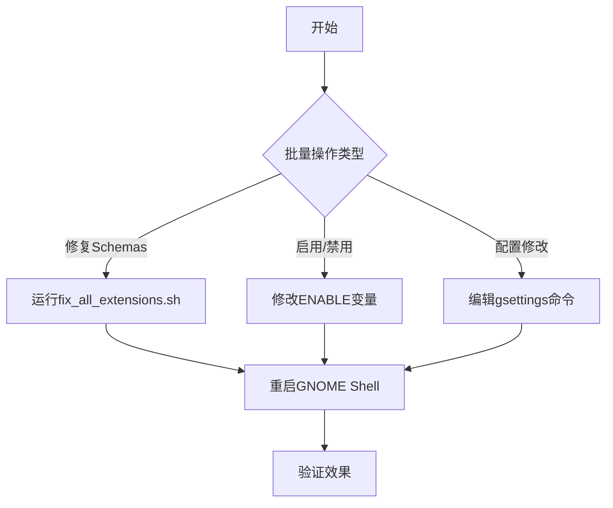

以下是批量操作用户安装的所有 GNOME 扩展的完整解决方案，涵盖 **Schemas 修复、启用/禁用、配置修改** 等常见需求：

---

### **1. 批量修复所有用户扩展的 Schemas**
```bash
#!/bin/bash
# 遍历 ~/.local/share/gnome-shell/extensions/ 下所有扩展
for EXT_DIR in ~/.local/share/gnome-shell/extensions/*/; do
    EXT_ID=$(basename "$EXT_DIR")
    echo "处理扩展: $EXT_ID"

    # 检查是否存在 schemas
    if [ -d "$EXT_DIR/schemas" ]; then
        # 编译扩展自身的 schemas
        glib-compile-schemas "$EXT_DIR/schemas"

        # 复制到用户全局 schemas 目录
        mkdir -p ~/.local/share/glib-2.0/schemas/
        cp "$EXT_DIR/schemas"/*.xml ~/.local/share/glib-2.0/schemas/
    fi
done

# 最终编译用户全局 schemas
glib-compile-schemas ~/.local/share/glib-2.0/schemas/
ls ~/.local/share/glib-2.0/schemas/
gsettings list-schemas | grep "org.gnome.shell.extensions"

# 重启 GNOME Shell
killall -3 gnome-shell
```

**使用方法**：
1. 将脚本保存为 `fix_all_extensions.sh`
2. 添加执行权限：`chmod +x fix_all_extensions.sh`
3. 运行：`./fix_all_extensions.sh`

---

### **2. 批量启用/禁用所有用户扩展**
```bash
#!/bin/bash
# 启用所有扩展
ENABLE=true  # 设为 false 则禁用所有

for EXT_DIR in ~/.local/share/gnome-shell/extensions/*/; do
    EXT_ID=$(basename "$EXT_DIR")
    if [ "$ENABLE" = true ]; then
        gnome-extensions enable "$EXT_ID"
        echo "已启用: $EXT_ID"
    else
        gnome-extensions disable "$EXT_ID"
        echo "已禁用: $EXT_ID"
    fi
done
```

---

### **3. 批量修改所有扩展的相同配置项**
例如：强制所有扩展不显示顶部面板图标
```bash
#!/bin/bash
for EXT_DIR in ~/.local/share/gnome-shell/extensions/*/; do
    EXT_ID=$(basename "$EXT_DIR")
    SCHEMA="org.gnome.shell.extensions.${EXT_ID%%@*}"

    # 如果 schema 存在且包含 show-panel-icon 键
    if gsettings list-schemas | grep -q "$SCHEMA" && \
       gsettings list-keys "$SCHEMA" | grep -q "show-panel-icon"; then
        gsettings set "$SCHEMA" show-panel-icon false
        echo "已配置: $EXT_ID"
    fi
done
```

---

### **4. 批量导出/导入扩展配置**
#### **导出配置**
```bash
#!/bin/bash
BACKUP_DIR=~/gnome_extensions_backup
mkdir -p "$BACKUP_DIR"

for EXT_DIR in ~/.local/share/gnome-shell/extensions/*/; do
    EXT_ID=$(basename "$EXT_DIR")
    SCHEMA="org.gnome.shell.extensions.${EXT_ID%%@*}"

    if gsettings list-schemas | grep -q "$SCHEMA"; then
        gsettings list-recursively "$SCHEMA" > "$BACKUP_DIR/${EXT_ID}.conf"
        echo "已备份: $EXT_ID"
    fi
done
```

#### **导入配置**
```bash
#!/bin/bash
BACKUP_DIR=~/gnome_extensions_backup

for CONFIG_FILE in "$BACKUP_DIR"/*.conf; do
    EXT_ID=$(basename "$CONFIG_FILE" .conf)
    SCHEMA="org.gnome.shell.extensions.${EXT_ID%%@*}"

    while read -r line; do
        KEY=$(echo "$line" | awk '{print $2}')
        VALUE=$(echo "$line" | cut -d' ' -f3-)
        gsettings set "$SCHEMA" "$KEY" "$VALUE"
    done < "$CONFIG_FILE"
done
```

---

### **5. 高级操作：批量更新扩展**
```bash
#!/bin/bash
# 检查所有扩展的 metadata.json 中的版本号
for EXT_DIR in ~/.local/share/gnome-shell/extensions/*/; do
    EXT_ID=$(basename "$EXT_DIR")
    VERSION=$(jq -r '.version' "$EXT_DIR/metadata.json")
    echo "$EXT_ID : $VERSION"
    # 可在此添加 git pull 或下载逻辑
done
```

---

### **6. 注意事项**
1. **依赖工具**：
   - `jq`：用于解析 JSON（安装：`sudo dnf install jq`）
   - `glib-compile-schemas`：通常已随 GNOME 安装

2. **安全提示**：
   
   ```bash
   # 操作前建议先备份
   cp -r ~/.local/share/gnome-shell/extensions/ ~/extensions_backup
   ```
   
3. **扩展兼容性**：
   - 部分扩展可能使用非标准路径，需单独处理
   - 可通过 `gnome-extensions list` 验证扩展 ID

---

### **完整工作流示例**


通过以上脚本，您可以高效管理大量 GNOME 扩展。如需针对特定扩展定制操作，可以提取扩展 ID 后单独处理。